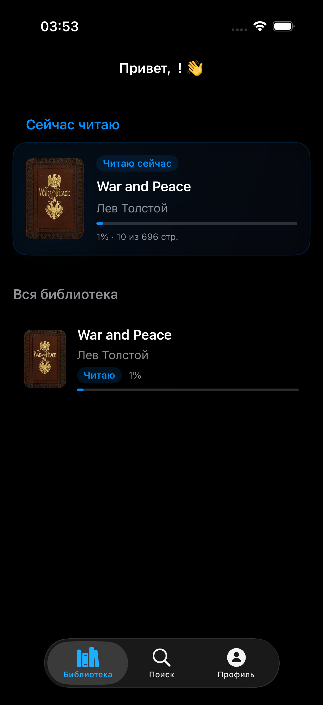
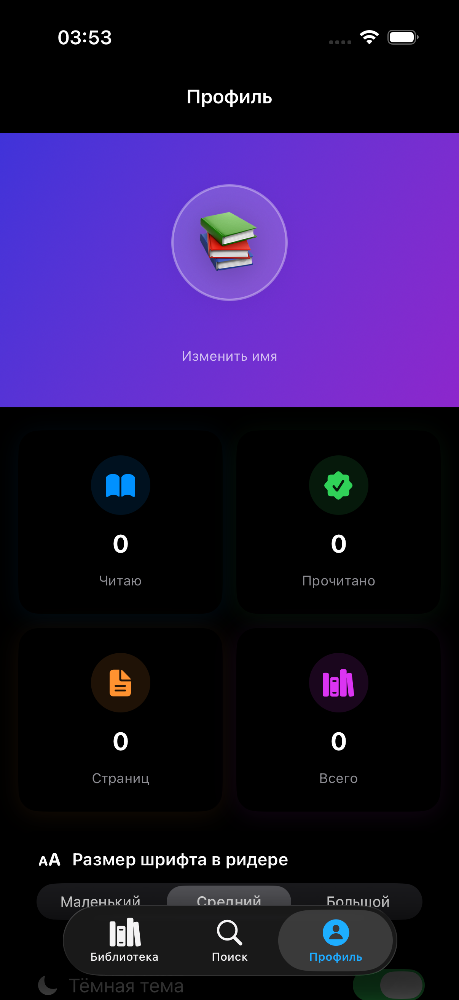
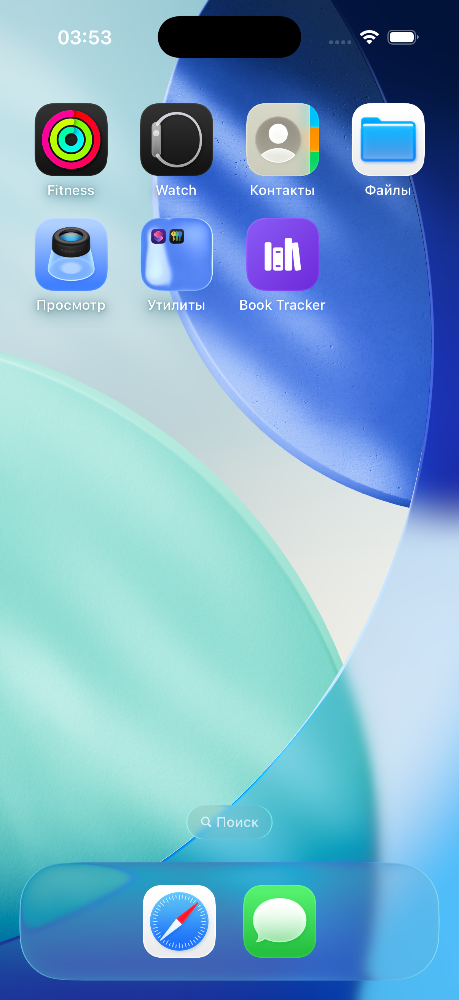

# Book Tracker — iOS-приложение для чтения

Нативное iOS-приложение для поиска, чтения и отслеживания книг. Ищите среди миллионов изданий, читайте бесплатные фрагменты с реальным текстом и следите за прогрессом чтения — всё в одном месте.

[](https://swift.org)
[](https://developer.apple.com/swiftui/)
[](https://developer.apple.com/ios/)

---

## Возможности

- **Поиск книг** — поиск по названию или автору через Open Library API с мгновенными результатами
- **Встроенный ридер** — чтение реального текста книг из Project Gutenberg с шрифтом с засечками, настраиваемым размером и постраничной навигацией
- **Обложки книг** — автоматическая загрузка из Open Library и Gutenberg
- **Прогресс чтения** — отслеживание прочитанных страниц и процента завершения для каждой книги
- **Профиль и статистика** — общее количество книг, прочитанных страниц, счётчики «читаю» и «прочитано»
- **Тёмная тема** — полная поддержка Dark Mode с переключателем в профиле
- **Сохранение данных** — библиотека и настройки сохраняются локально между сессиями
- **Статусы чтения** — отметки «Читаю» и «Прочитано»

---

## Скриншоты

| Библиотека | Детали книги | Ридер | Профиль | Иконка |
|:---:|:---:|:---:|:---:|:---:|
|  |  |  |  |  |

---

## Стек технологий

| Технология | Назначение |
|---|---|
| Swift 5.9 | Язык разработки |
| SwiftUI | Декларативный UI-фреймворк |
| MVVM | Архитектурный паттерн |
| Open Library API | Поиск книг, метаданные, обложки |
| Gutenberg API (Gutendex) | Полные тексты книг для ридера |
| UserDefaults | Локальное хранение библиотеки и настроек |
| async/await | Асинхронные сетевые запросы |
| AsyncImage | Асинхронная загрузка обложек |

---

## Как запустить

1. Клонируйте репозиторий:
   ```bash
   git clone https://github.com/your-username/book-tracker.git
   ```
2. Откройте проект в Xcode:
   ```bash
   cd book-tracker
   open "Book Tracker.xcodeproj"
   ```
3. Выберите симулятор (iPhone 15 или новее) или физическое устройство.
4. Нажмите **Cmd+R** для сборки и запуска.

**Требования:** Xcode 15+, iOS 17+, интернет-соединение для поиска и загрузки книг.

---

## Структура проекта

```
Book Tracker/
├── Book_TrackerApp.swift    — Точка входа
├── ContentView.swift        — Корневой TabView и сохранение данных
├── Book.swift               — Модель данных книги
├── LibraryView.swift        — Экран библиотеки с пустым состоянием
├── SearchView.swift         — Поиск книг с живыми результатами
├── BookDetailView.swift     — Детали книги и действия
├── WebView.swift            — Постраничный ридер
├── ProfileView.swift        — Профиль пользователя и статистика
├── AppSettings.swift        — Настройки приложения (размер шрифта, тёмная тема)
├── NetworkManager.swift     — Сетевой слой (Open Library + Gutenberg)
└── AddBookView.swift        — Форма ручного добавления книги
```

---

## Лицензия

MIT License. Подробнее в [LICENSE](LICENSE).
